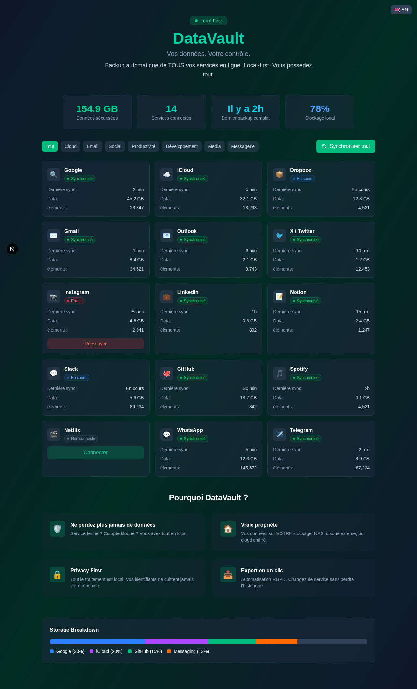

# 🔐 DataVault

> **Your Data. Your Control.**  
> Backup automatique et continu de TOUS vos services en ligne vers votre stockage local.




## 🎯 Le Problème

Votre vie numérique est dispersée sur 100+ services : Google, iCloud, réseaux sociaux, banques, emails, messageries...

**Que se passe-t-il si :**
- Un service ferme (comme Google+, Vine, Flickr...) ?
- Votre compte est bloqué/hacké ?
- Vous voulez changer de service sans perdre 10 ans d'historique ?
- Vous voulez simplement **posséder** vos données ?

**Réponse actuelle :** Vous perdez tout. Ou vous passez des heures sur des exports RGPD manuels.

## 💡 La Solution

**DataVault** synchronise automatiquement tous vos services vers votre stockage local (NAS, disque externe, cloud chiffré que vous contrôlez).

- ✅ **Backup continu** — Vos données sont mirrored en temps réel
- ✅ **Local-first** — Tout reste sur VOTRE machine
- ✅ **Privacy-first** — Credentials chiffrés, processing local
- ✅ **Un seul dashboard** — Visualisez tout votre univers digital

## 🖥️ Screenshots

Le prototype inclut un dashboard fonctionnel avec :
- Vue de tous les services connectés (Google, iCloud, Twitter, GitHub, Slack, WhatsApp...)
- Statuts de synchronisation en temps réel
- Visualisation du stockage utilisé
- Filtrage par catégorie
- Interface bilingue FR/EN

## 🚀 Quick Start

### Prérequis

- Node.js 20+ (recommandé : 22+)
- npm, yarn, pnpm ou bun

### Installation

```bash
# Cloner le repo
git clone https://github.com/PierrickLozach/DataVault.git
cd DataVault

# Installer les dépendances
npm install

# Lancer le serveur de développement
npm run dev
```

Ouvrir [http://localhost:3000](http://localhost:3000) dans votre navigateur.

### Build Production

```bash
npm run build
npm start
```

## 🏗️ Stack Technique

| Technologie | Usage |
|-------------|-------|
| **Next.js 16** | Framework React avec App Router |
| **TypeScript** | Typage statique |
| **Tailwind CSS 4** | Styling utility-first |
| **React 19** | UI Components |

## 📁 Structure du Projet

```
datavault/
├── src/
│   └── app/
│       ├── page.tsx      # Dashboard principal
│       ├── layout.tsx    # Layout racine
│       └── globals.css   # Styles globaux
├── public/               # Assets statiques
├── next.config.ts        # Config Next.js
├── tailwind.config.ts    # Config Tailwind
└── package.json
```

## 🎨 Features du Prototype

### Dashboard Principal
- **Stats globales** : données totales, services connectés, dernier backup, stockage
- **Grille de services** : 15+ services simulés avec statuts
- **Filtrage** : par catégorie (Cloud, Email, Social, Productivity, Dev, Media, Messaging)
- **Sync global** : bouton pour synchroniser tous les services

### Services Simulés
| Catégorie | Services |
|-----------|----------|
| Cloud | Google, iCloud, Dropbox |
| Email | Gmail, Outlook |
| Social | Twitter/X, Instagram, LinkedIn |
| Productivity | Notion, Slack |
| Dev | GitHub |
| Media | Spotify, Netflix |
| Messaging | WhatsApp, Telegram |

### Interactions
- **Connect** : Modal de connexion pour les services non connectés
- **Sync** : Animation de synchronisation
- **Retry** : Bouton de retry pour les services en erreur
- **Language toggle** : FR/EN

## 🗺️ Roadmap (Vision Produit)

### Phase 1 — MVP Desktop
- [ ] App Electron pour Mac/Windows/Linux
- [ ] Connecteurs OAuth pour services majeurs (Google, iCloud, Dropbox)
- [ ] Stockage local chiffré (SQLite + encryption at rest)
- [ ] Scheduler de backup automatique

### Phase 2 — Connecteurs
- [ ] Réseaux sociaux (Twitter, Instagram, LinkedIn, Facebook)
- [ ] Messaging (WhatsApp, Telegram, Signal, Discord)
- [ ] Productivity (Notion, Slack, Trello, Asana)
- [ ] Dev (GitHub, GitLab, Bitbucket)
- [ ] Finance (exports bancaires)

### Phase 3 — Features Avancées
- [ ] Recherche full-text dans toutes les données
- [ ] Timeline unifiée (tous vos posts/messages/emails chronologiquement)
- [ ] Export vers autre service (migration assistée)
- [ ] Versioning (historique des modifications)
- [ ] NAS sync (Synology, QNAP)

### Phase 4 — Mobile & Sync
- [ ] App mobile (iOS/Android)
- [ ] Sync cross-device (optionnel, E2E encrypted)
- [ ] Self-hosted server option

## 🔒 Philosophie Sécurité

1. **Local-first** — Les données ne quittent jamais votre machine par défaut
2. **Zero-knowledge** — Même nous ne pouvons pas lire vos données
3. **Credentials isolation** — Chaque service a ses propres credentials chiffrés
4. **Open source** — Code auditable

## 🤝 Contribuer

Les contributions sont les bienvenues ! 

```bash
# Fork le repo
# Crée une branche feature
git checkout -b feature/amazing-feature

# Commit
git commit -m 'Add amazing feature'

# Push
git push origin feature/amazing-feature

# Ouvre une PR
```

## 📝 License

MIT — Faites-en ce que vous voulez.

---

<p align="center">
  <strong>DataVault</strong> — Parce que vos données vous appartiennent.
</p>
